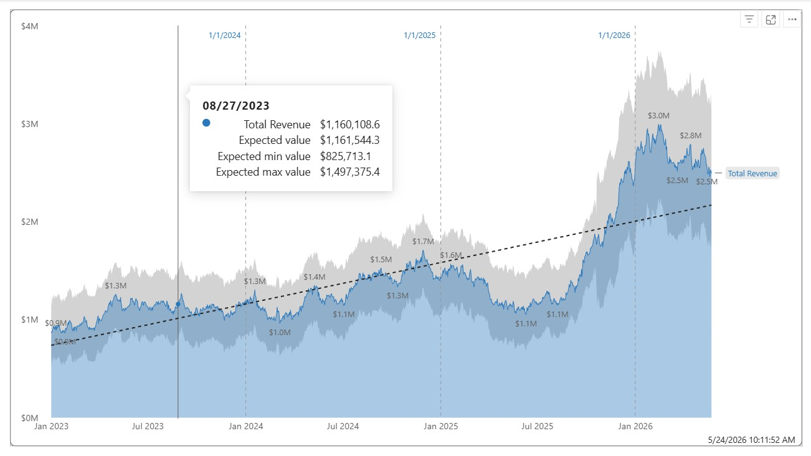
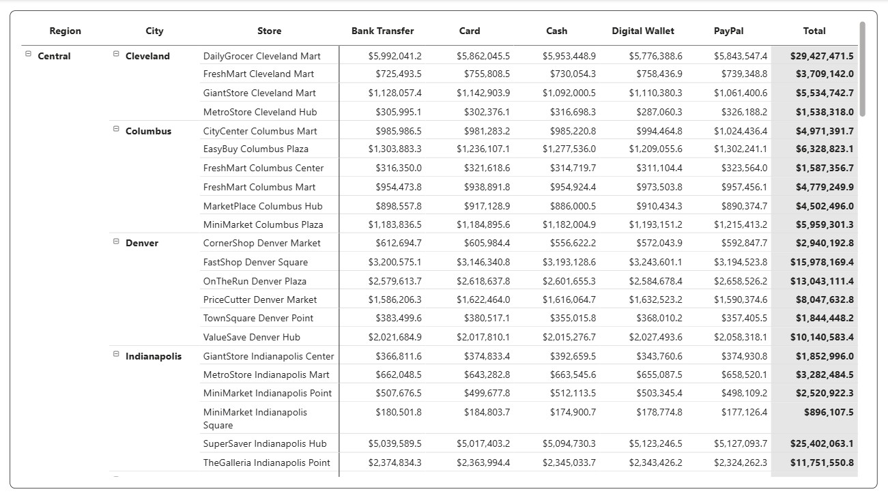
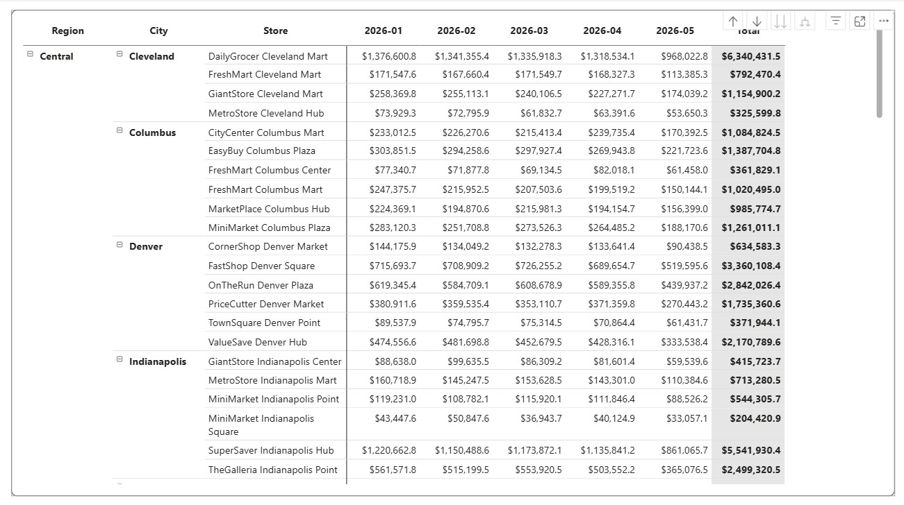

# Retail Analytics – End-to-End Data Pipeline

## Project Goal
Build a complete, reproducible data pipeline for retail transaction analytics.  
It generates **10 million sales rows** plus dimension tables (customers, products, stores, promotions, date), enforces business rules (product margin ≤ 30% with a realistic distribution, no NULLs, `deliverydays = 0` for In-Store, `hour` column, `promoid = 0` as dummy promotion, all percentages stored as fractions ready for Power BI), processes data in a medallion architecture (bronze → silver → gold) using Microsoft Fabric, and provides ready‑to‑use analytical tables and validation scripts.

## What has been done

### 1. Data generation (Python 3.8+, pandas, numpy)
Script `final_retail_gen.py` creates six CSV files:

- `dim_date.csv` – date dimension (2023‑01‑01 to today)
- `dim_customer.csv` – 200k customers with demographics, RFM attributes
- `dim_product.csv` – 2k products, margin capped at **30%** with a realistic distribution (stored as fraction, e.g. `0.1196`)
- `dim_store.csv` – 200 stores, unique names, region, type, size, rating
- `dim_promotion.csv` – 100 promotions plus dummy `promoid=0` (discount percentages stored as fraction, e.g. `0.2500`)
- `fact_sales.csv` – 10 million sales rows with `hour`, `deliverydays`, `returnreason`, `grossvalue`, `discountamount`, `net`, etc.

**Key improvements in the generator (v3):**
- Daily net‑sales targets are met by **scaling quantities**, not monetary values – this preserves product margins in the fact table and avoids inflated negative margins.
- `discountapplied` flag is now set **after** rounding `discountamount`, eliminating spurious mismatches.
- Gender strings use only `Male`/`Female`, ensuring consistency with SQL validation checks.
- All percentage columns (`margin_pct`, `discount_pct`) are exported as decimal fractions (e.g. `0.1196`), which Power BI automatically displays as `11.96%` when formatted as percentage.
- Product margins follow a realistic distribution: 5% at 30%, 5% between 20‑29%, 5% at 15%, 50% between 5‑10%, 30% between 0‑5%, and 5% between 0 and -10%.
- Increased variance in store sizes, customer incomes, and product prices for more realistic analytical patterns.

### 2. Data loading into SQL Server
Script `final_retail_loader.sql` creates database `retailanalytics`, tables, inserts all CSVs, adds primary/foreign keys and a clustered columnstore index on `factsales`.

### 3. Analytical views (SQL Server)
Script `deploy_all_analytical_views.sql` creates 17 analytical views in `retailanalytics`:
- Product category margin (001)
- Promotion performance vs baseline (002)
- Customer RFM segments (003)
- Returns analysis (004)
- Channel performance (005)
- Seasonal category revenue (006)
- Store performance by region & type (007)
- Pareto margin analysis (008)
- Delivery speed impact on returns (009)
- Warranty & eco‑friendly impact (010)
- Hourly sales & margin analysis (011)
- Pareto revenue & margin combined (012)
- Basket analysis – frequently bought together (013)
- Detailed delivery speed impact on margin (014)
- Margin by price tier & category (015)
- Recency impact on spend (016)
- Promotion margin efficiency (017)

All margin and discount columns are stored as fractions, ready for Power BI percentage formatting.

### 4. Validation scripts (SQL Server)
- `03_data_quality_checks.sql` – comprehensive data quality checks (row counts, PK uniqueness, orphan checks, hour validation, returnreason integrity, deliverydays logic, fraction range checks).
- `check_product_margins.sql` – verifies that product margins follow the expected distribution (fraction -0.10 to 0.30).
- `model_validation.sql` – checks star schema integrity, foreign keys, clustered columnstore index.

### 5. Microsoft Fabric notebooks (PySpark)
Five notebooks implement the medallion architecture:

- `01_bronze_ingestion.py` – reads CSVs, adds audit columns, writes Delta tables to `01_bronze_db`.
- `02_silver_transformation.py` – cleans, casts types, deduplicates, ensures dummy promotion (`promoid=0`), writes to `02_silver_db`.
- `03_gold_views.py` – creates 17 materialized Delta tables in `03_gold_db` (same logic as SQL analytical views).
- `04_optimization.py` – compacts Delta tables and applies Z‑ordering on frequently filtered columns.
- `05_silver_gold_validation.sql` – data quality checks for silver and gold layers (formatted output).

### 6. Analysis queries
Ready‑to‑run queries in T‑SQL, DAX, and Python (pandas) for all key metrics (total revenue, COGS, gross profit, margin %, return rate, discount penetration, etc.). All monetary values are formatted with thousand separators and zero decimal places; percentages are displayed with two decimal places.

### 7. Dashboards built on the generated data
The following reports were built using Power BI connected to the SQL Server database. They demonstrate the quality and analytical readiness of the data.


*Revenue Trend – visualising the enforced daily net‑sales pattern (decline → flat → strong rise).*


*Payment Matrix – breakdown of payment methods by channel.*


*Monthly Revenue – seasonal revenue pattern with clear peaks in December.*

## Technologies used
- **Python** for data generation (pandas, numpy)
- **Microsoft Fabric** for Lakehouse and PySpark
- **SQL Server / T‑SQL** for loading and validation
- **Power BI** for reporting

## How to reproduce the pipeline step by step

### A. Generate CSV files
- Install Python 3.8+ with pandas and numpy.
- Run `final_retail_gen.py`. It will create six CSV files in `c:/data/` (adjust `OUTPUT_DIR` if needed).

### B. Load into SQL Server
- In SSMS or Azure Data Studio, execute `final_retail_loader.sql`. It creates database `retailanalytics`, all tables, loads data, adds indexes.
- Run `deploy_all_analytical_views.sql` to create the 17 analytical views.
- Run `03_data_quality_checks.sql` and `check_product_margins.sql` to verify data quality.
- Run `model_validation.sql` to confirm schema integrity.

### C. Run in Microsoft Fabric
- Upload the six CSV files to your Lakehouse `Files/raw/` folder.
- Open a Fabric notebook and run the scripts in order:
  1. `01_bronze_ingestion.py`
  2. `02_silver_transformation.py`
  3. `03_gold_views.py`
  4. `04_optimization.py`
  5. `05_silver_gold_validation.sql` (run this cell as SQL)
- Query gold tables from SQL endpoint, for example:
  ```sql
  SELECT * FROM 03_gold_db.vw_001_product_category_margin LIMIT 10;
  D. Power BI reporting
Connect to the SQL endpoint of your Fabric Lakehouse (or to SQL Server).

Create measures: Total Revenue, Total COGS, Gross Margin percentage.

Build dashboards (examples: Revenue Trend, Payment Matrix, Monthly Revenue).

File reference
File	Description
final_retail_gen.py	Generates 10M rows + dimensions, margin ≤30% with distribution, fraction storage
final_retail_loader.sql	Creates SQL Server database, tables, loads CSVs
deploy_all_analytical_views.sql	Creates 17 analytical views
03_data_quality_checks.sql	Comprehensive data quality checks
check_product_margins.sql	Validates product margins (fraction -0.10..0.30)
model_validation.sql	Star schema integrity, foreign keys, CCI
01_bronze_ingestion.py	Reads CSVs into bronze Delta tables
02_silver_transformation.py	Cleans, casts, deduplicates, adds dummy promo
03_gold_views.py	Creates 17 materialized gold tables in 03_gold_db
04_optimization.py	Compaction and Z‑order for Delta tables
05_silver_gold_validation.sql	Data quality checks for silver/gold layers
06_analysis_queries.py	Analytical queries on silver data
analysis_queries.py	Analytical queries using pandas (standalone)
comprehensive_tsql_queries.sql	Ready‑to‑run T‑SQL analytical queries
License
MIT – free to use, modify, and distribute.
